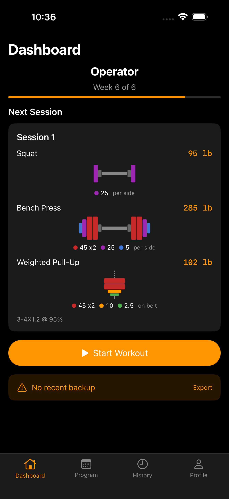
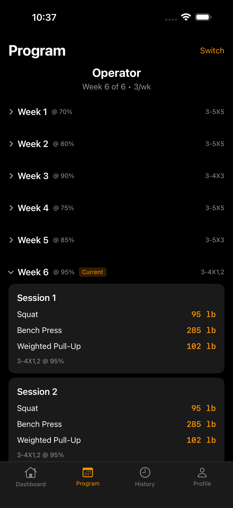
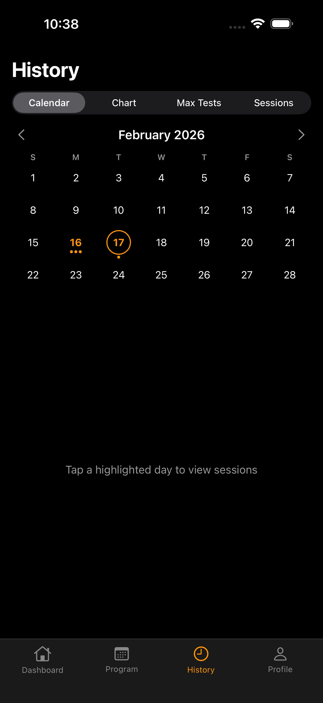
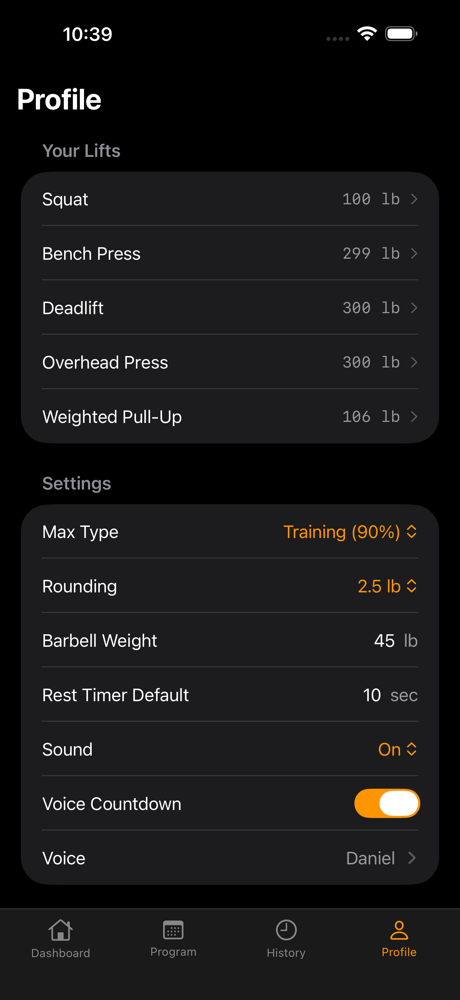
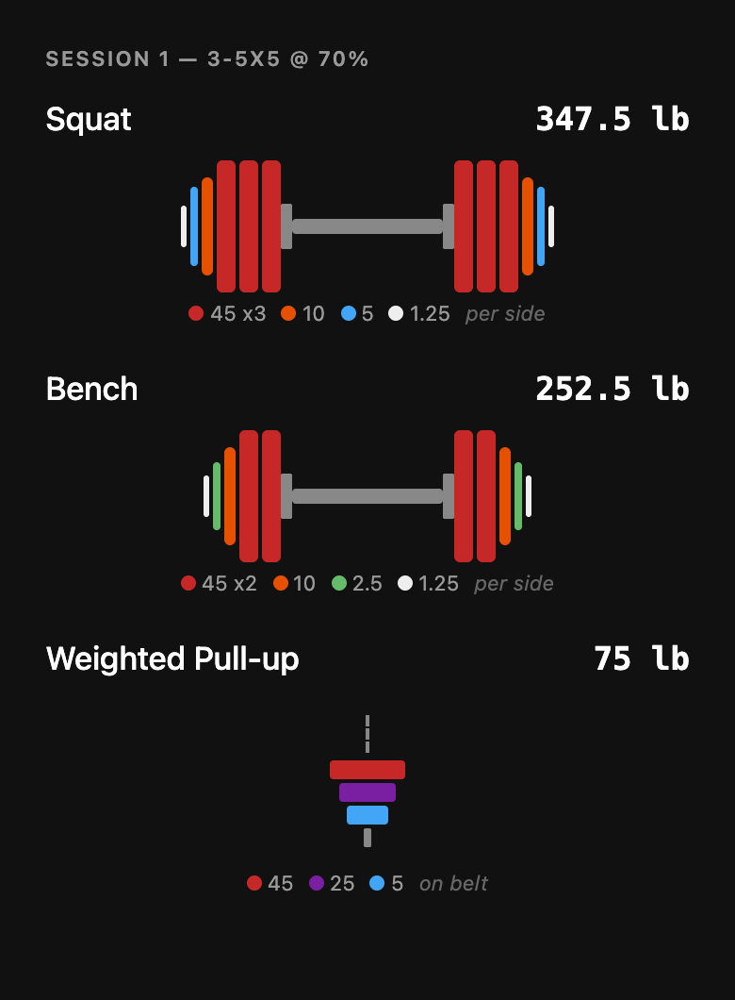
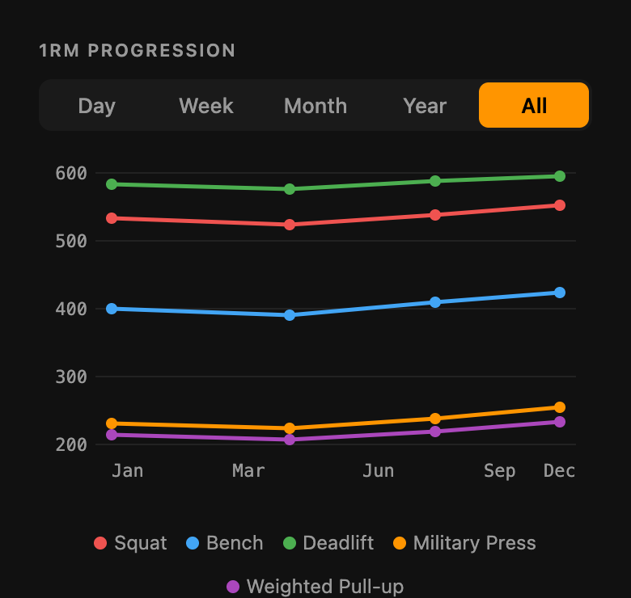

# TB3 — Tactical Barbell Companion

A dual-platform strength training system built around the Tactical Barbell methodology. Native iOS app + installable PWA, backed by a shared AWS serverless backend with cross-device sync, Chromecast support, Strava integration, and Spotify playback controls.

<p align="center">
  
  
  
  
</p>

## Platform Overview

| | iOS App | Web PWA |
|---|---|---|
| **Framework** | SwiftUI + SwiftData | Preact 10 + Signals |
| **Source** | 85+ Swift files | 67 TypeScript files |
| **Storage** | SwiftData (SQLite, App Group shared) | IndexedDB |
| **Cast** | Google Cast SDK (CocoaPods) | Google Cast SDK (lazy-loaded) |
| **Strava** | OAuth2 via ASWebAuthenticationSession | — |
| **Spotify** | Web API — now playing, playback controls, library | — |
| **Siri** | App Intents (Start Workout, Log 1RM, What's Next) | — |
| **Widgets** | WidgetKit (Next Workout, Lift PRs, Progress, Strength Trend) | — |
| **Offline** | Native | Service worker + precache |

Both platforms share the same Cognito auth, DynamoDB sync backend, and training logic.

## Features

### Training Programs

Seven Tactical Barbell templates with correct periodization, set/rep schemes, and percentage progressions:

| Template | Days/Week | Duration | Description |
|---|---|---|---|
| **Operator** | 3 | 6 weeks | Standard strength — fixed lifts, set range |
| **Zulu** | 4 | 6 weeks | A/B cluster split — different percentages per cluster |
| **Fighter** | 2 | 6 weeks | Minimal strength — 2-3 lifts, compatible with high skill work |
| **Gladiator** | 3 | 6 weeks | All cluster lifts every session, week 6 descending sets |
| **Mass Protocol** | 3 | 6 weeks | Hypertrophy-focused, no rest minimums |
| **Mass Strength** | 3 | 3 weeks | Squat/Bench/WPU + Deadlift alternating sessions |
| **Grey Man** | 3 | 12 weeks | Extended cycle, all cluster lifts every session |

The schedule generator pre-computes every session for the entire cycle — target weights, plate breakdowns, set counts — so there's no calculation during workouts.

### Visual Plate Loading

Every exercise shows a color-coded barbell or belt diagram. Heaviest plates sit closest to the collar, with a legend showing the exact breakdown per side.

<p align="center">
  
</p>

### Active Workout Tracking

- Set-by-set tracking with rest timers and weight overrides
- Two-phase timer — rest count-up with overtime detection + exercise duration tracking
- Voice announcements with countdown milestones and configurable voice
- Undo last set, auto-regulate (finish early after minimum sets)
- Session persistence — survives crashes, force-quit, and phone death

### 1RM Progression Charts

Per-lift line graphs with Day/Week/Month/Year/All time range filtering.

<p align="center">
  
</p>

### Chromecast

Cast your workout to any TV with a two-column layout optimized for 16:9 screens. Left side shows exercise, weight, and plate diagram; right side shows set progress, reps, and rest timer. Footer displays Spotify now-playing with album art, exercise progress bars, and session elapsed time. Clock updates in real time.

<p align="center">
  
</p>

### Spotify Integration

See what's playing and control Spotify directly from the workout session screen. Album art, track name, and artist display on both the phone and Chromecast.

- OAuth2 PKCE connect/disconnect from Profile → Integrations
- Now-playing bar with album art, track name, and artist during workouts
- Playback controls — previous, play/pause, next
- Like/unlike tracks from the session screen (saved to your Spotify library)
- Auto-polls every 5 seconds while a workout is active
- Chromecast displays album art via base64 data URI (bypasses WebView CORS restrictions)
- Client secret stays server-side via Lambda token proxy

### Strava Integration

Share completed workouts to Strava as Weight Training activities. Posts include exercise names, weights, sets, reps, template name, week number, and working percentage.

- OAuth2 connect/disconnect from Profile → Integrations
- Privacy consent sheet before first connection
- Auto-share toggle for hands-free posting on workout completion
- Manual share from session history
- Client secret stays server-side via Lambda token proxy

### Cloud Sync

Cross-device sync via Cognito auth (email/password + Google OAuth2). Push/pull protocol with automatic token refresh on 401. Last-write-wins for singletons (profile, active program), union-by-ID for sessions and 1RM tests.

### Siri Shortcuts & App Intents (iOS)

Three App Intents exposed to Siri, Shortcuts app, and Spotlight:

- **Start Workout** — Launches today's scheduled session directly from Siri or the Action Button
- **Log 1RM Test** — Record a new one-rep max for any lift via voice or Shortcuts
- **What's My Next Workout?** — Returns schedule info with exercises, weights, and sets

### Home Screen Widgets (iOS)

Four WidgetKit widgets for glanceable workout data:

- **Next Workout** — Template name, week/session, exercises with target weights (small + medium)
- **Lift PRs** — Current 1RM and working max for all lifts with color-coded bars (small + medium)
- **Progress** — Program completion ring with week counter (small + lock screen circular)
- **Strength Trend** — Multi-line 1RM progression chart over the last 6 months (small + medium)

Widgets share data via App Group container and refresh on set completion, 1RM test, or sync.

### Additional Features

- **1RM Calculator** — Epley formula with training max (90%), percentage tables at 65-100%
- **Plate Calculator** — Greedy algorithm for barbell and weight belt loading with configurable inventory
- **Session History** — Complete log with calendar view and per-exercise detail
- **Data Export/Import** — JSON export with 12-step validated import
- **Offline-First** — Full functionality without network on both platforms

## iOS Roadmap

See [ios/ROADMAP.md](ios/ROADMAP.md) for planned iOS-native enhancements including Live Activities, HealthKit, Apple Watch, Siri Shortcuts, WidgetKit, and more.

## Tech Stack

| Layer | Technology |
|---|---|
| **iOS** | |
| UI | SwiftUI + SwiftData |
| State | `@Observable` AppState |
| Siri | AppIntents (3 shortcuts) |
| Widgets | WidgetKit (4 widgets, App Group shared container) |
| Cast | Google Cast SDK (CocoaPods) |
| Strava | ASWebAuthenticationSession + Keychain token storage |
| Spotify | Web API + OAuth2 PKCE + Keychain token storage |
| **Web** | |
| UI | [Preact](https://preactjs.com/) 10 + [Preact Signals](https://preactjs.com/guide/v10/signals/) |
| Build | [Vite](https://vitejs.dev/) 6 + TypeScript 5 |
| PWA | [vite-plugin-pwa](https://vite-pwa-org.netlify.app/) (Workbox) |
| Storage | IndexedDB via [idb-keyval](https://github.com/nicedoc/idb-keyval) |
| **Backend** | |
| Auth | [Amazon Cognito](https://aws.amazon.com/cognito/) (SRP + Google OAuth2 PKCE) |
| API | AWS API Gateway HTTP API + Lambda (Node.js 20) |
| Database | DynamoDB (single-table, PAY_PER_REQUEST) |
| Hosting | S3 + CloudFront (OAC, HTTPS, security headers) |
| IaC | [AWS CDK](https://aws.amazon.com/cdk/) v2 (TypeScript) |

## Project Structure

```
TB3_Tactical_Barbell/
├── app/                          # Web PWA (Preact + Vite)
│   ├── src/
│   │   ├── calculators/          # 1RM and plate math
│   │   ├── components/           # UI components (session, plate display, charts, cast)
│   │   ├── hooks/                # useAuth, useSync
│   │   ├── screens/              # Dashboard, History, Program, Profile, Session
│   │   │   ├── auth/             # Login, SignUp, ForgotPassword, ConfirmEmail
│   │   │   └── onboarding/       # 4-step setup wizard
│   │   ├── services/             # Auth, cast, storage, sync, validation, feedback
│   │   ├── templates/            # 7 template definitions + schedule generator
│   │   ├── app.tsx               # Root component + hash-based router
│   │   ├── state.ts              # Global signal state
│   │   └── style.css             # Design system
│   ├── cast-receiver/            # Chromecast receiver (standalone HTML/JS, no build)
│   └── package.json
├── ios/                          # Native iOS app (SwiftUI + SwiftData)
│   ├── TB3/
│   │   ├── Calculators/          # 1RM and plate math (mirrors web)
│   │   ├── Config/               # App configuration, Strava/Cast credentials
│   │   ├── Extensions/           # Color+TB3, Date+Formatting, Keychain, PKCE
│   │   ├── Intents/              # App Intents for Siri shortcuts
│   │   ├── Models/               # SwiftData models + sync payloads
│   │   ├── Networking/           # API client, auth, sync, token management
│   │   ├── Services/             # Strava, Spotify, Cast, feedback, validation, export/import, SharedContainer
│   │   ├── State/                # AppState, AuthState, SyncState, CastState, StravaState, SpotifyState
│   │   ├── Templates/            # Template definitions + schedule generator
│   │   ├── ViewModels/           # Auth, Onboarding, Profile, Session
│   │   └── Views/                # Auth, Dashboard, History, Onboarding, Profile, Program, Session
│   ├── TB3Widgets/               # WidgetKit extension (4 home screen widgets)
│   ├── TB3LiveActivity/          # Live Activity extension
│   ├── TB3Tests/                 # 14 test files (calculators, services, templates, models)
│   ├── TB3.xcworkspace/          # Use this for builds (CocoaPods)
│   └── Podfile
├── infra/                        # AWS CDK infrastructure
│   ├── lib/
│   │   ├── tb3-stack.ts          # S3, CloudFront, Cognito
│   │   └── tb3-api-stack.ts      # API Gateway, Lambda, DynamoDB
│   ├── lambda/
│   │   ├── sync.ts               # Push/pull sync endpoint
│   │   ├── strava-token.ts       # Strava OAuth token exchange proxy
│   │   └── spotify-token.ts      # Spotify OAuth token exchange proxy
│   ├── iam/                      # Deployer IAM user setup
│   └── package.json
├── docs/                         # Screenshots for README
├── deploy.sh                     # Build + S3 sync + CloudFront invalidation
└── .gitignore
```

## Getting Started

### Prerequisites

- **Node.js** 20+
- **AWS CLI** v2 with configured credentials
- **AWS CDK** v2 (`npm install -g aws-cdk`)
- **Xcode** 16+ (for iOS)
- An AWS account with CDK bootstrapped (`cdk bootstrap`)

### 1. Clone and install

```bash
git clone https://github.com/tylerjacox/TB3_Tactical_Barbell.git
cd TB3_Tactical_Barbell

cd app && npm install && cd ..
cd infra && npm install && cd ..
```

### 2. Deploy infrastructure

```bash
# Create deployer IAM user (requires admin credentials)
bash infra/iam/setup-deployer.sh
aws configure --profile tb3-deployer

# Deploy CDK stacks
cd infra
AWS_PROFILE=tb3-deployer npx cdk deploy --all
cd ..
```

This creates:
- **Tb3Stack** — S3 bucket, CloudFront distribution, Cognito User Pool
- **Tb3ApiStack** — API Gateway, Lambda sync + Strava proxy, DynamoDB table

### 3. Build and deploy the web app

```bash
AWS_PROFILE=tb3-deployer bash deploy.sh
```

The deploy script reads CloudFormation outputs, generates `.env.production`, builds the Vite app, syncs to S3, and invalidates CloudFront.

### 4. Build the iOS app

```bash
cd ios
pod install
xcodebuild -workspace TB3.xcworkspace -scheme TB3 -sdk iphonesimulator \
  -destination 'platform=iOS Simulator,name=iPhone 16 Pro Max' build
```

### 5. Local web development

```bash
cp app/.env.example app/.env.local
# Fill in Cognito/API values from CDK outputs

cd app && npm run dev
```

## Architecture

### Data Flow

```
User action → State update → Local persistence → UI re-render
                                    ↓
                              Sync service (on network)
                                    ↓
                        API Gateway → Lambda → DynamoDB
```

Both platforms are offline-first. All data lives locally and syncs when connected.

### Schedule Pre-Computation

When a user starts a program, the schedule generator pre-computes every session:

1. Template definition + current 1RM values + plate inventory
2. Target weight per exercise per week (1RM × training max × week percentage)
3. Rounding to user's increment (2.5 or 5 lb)
4. Plate calculator for each weight
5. Full `ComputedSchedule` stored — no recalculation during workouts

A `sourceHash` detects when inputs change (new 1RM test, plate inventory edit) and prompts regeneration.

### Session Persistence

Active workout state is saved on every set completion. If the app crashes, is force-quit, or the phone dies, the workout resumes exactly where it left off.

## Testing

### Web — Vitest

```bash
cd app && npm test
```

167 tests across 11 files covering calculators, templates, schedule generation, validation, storage, and export/import.

### iOS — XCTest

```bash
cd ios
xcodebuild -workspace TB3.xcworkspace -scheme TB3 -sdk iphonesimulator \
  -destination 'platform=iOS Simulator,name=iPhone 16 Pro Max' test
```

174 tests across 14 files:

| Suite | Tests | Coverage |
|---|---|---|
| SessionViewModelTests | 24 | Session state, set completion, undo, timer, exercise navigation |
| SyncPayloadTests | 18 | Codable round-trips for all sync types |
| TemplateDefinitionTests | 18 | All 7 templates, session counts, percentages, set ranges |
| ScheduleGeneratorTests | 16 | Full schedule generation, plate breakdowns, week progression |
| OneRepMaxCalculatorTests | 15 | Epley formula, training max, rounding, percentage tables |
| PlateCalculatorTests | 15 | Barbell/belt loading, greedy algorithm, edge cases |
| EnumTests | 15 | LiftName, TemplateId, TimerPhase, WorkoutStatus, SoundMode |
| AppStateTests | 14 | Current lifts derivation, max type handling, schedule staleness |
| DateFormattingTests | 14 | ISO8601 parsing/output, display formats, ID generation |
| ValidationServiceTests | 14 | Runtime validation + 12-step import validation |
| FeedbackServiceTests | 11 | Voice milestones, configuration, sound modes |

## Security

- **CloudFront security headers** — CSP, HSTS, X-Frame-Options DENY, X-Content-Type-Options
- **Cognito SRP + OAuth2 PKCE** — Password never sent in plaintext; Google sign-in uses PKCE
- **User enumeration prevention** — `preventUserExistenceErrors` on Cognito client
- **JWT authorization** — API Gateway validates tokens, Lambda checks `sub` claim
- **DynamoDB isolation** — All items keyed by `USER#{cognitoUserId}`, no cross-user access
- **Import validation** — 12-step validation with prototype pollution defense
- **S3 private** — `BLOCK_ALL` public access, CloudFront OAC only
- **Strava/Spotify client secrets** — Server-side only via Lambda proxy, never in client code

## Environment Variables

| Variable | Description |
|---|---|
| `VITE_COGNITO_USER_POOL_ID` | Cognito User Pool ID |
| `VITE_COGNITO_CLIENT_ID` | Cognito App Client ID |
| `VITE_COGNITO_REGION` | AWS region |
| `VITE_COGNITO_DOMAIN` | Cognito hosted UI domain |
| `VITE_API_URL` | API Gateway endpoint URL |

Injected at build time by Vite. For production, `deploy.sh` generates them from CloudFormation outputs.

## License

All rights reserved.
